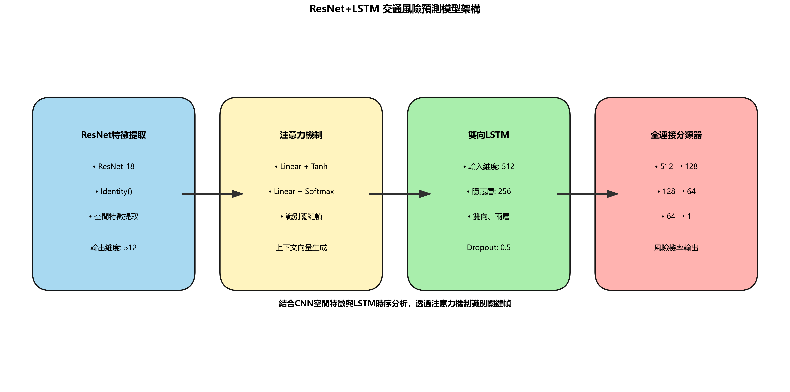

# 🚗 馬路三寶，別來撞我 (Road Hazards, Don't Hit Me)

<p align="center">
  
  <br>
  <em>ResNet+LSTM 交通風險預測模型架構</em>
</p>

> 🔗 專案 Git 倉庫: [https://github.com/lzt0104/2025Coding_101.git](https://github.com/lzt0104/2025Coding_101.git)

## 📋 目錄
- [專案概述](#-專案概述)
- [系統架構](#-系統架構)
- [技術亮點](#-技術亮點)
- [檔案結構](#-檔案結構)
- [快速開始](#-快速開始)
- [模型訓練](#-模型訓練)
- [實驗結果](#-實驗結果)
- [未來展望](#-未來展望)
- [團隊成員](#-團隊成員)

## 🌟 專案概述

「**馬路三寶，別來撞我**」是一個結合計算機視覺與深度學習技術的先進交通風險預測系統。本系統能即時分析交通視頻序列，偵測危險駕駛行為，並在危險發生前發出警告，為用路人創造更安全的道路環境。

### 💡 核心功能

- **🔍 即時風險偵測**：系統能連續監控交通場景，依據時序變化預測潛在危險
- **🔊 主動警示系統**：當檢測到危險情況時，立即發出「Slow down」的語音警告
- **🎯 高精準分析**：結合 ResNet 空間特徵提取與 LSTM 時序分析，F1 分數高達 97.5%
- **🖥️ 多平台支援**：支援一般電腦與嵌入式系統（如樹莓派），實現廣泛應用場景

<p align="center">
  
  <br>
  <em>模型訓練損失與 F1 Score 歷史</em>
</p>

## 🏗️ 系統架構

本專案採用多階段處理管線，包含四大核心模組：

### 1️⃣ 影像擷取與預處理模組
- 從相機或影片擷取連續幀
- 進行調整大小、正規化等預處理
- 構建時間序列窗口

### 2️⃣ 特徵提取與時序分析模組
- **ResNet-18** 提取豐富的空間特徵
- **注意力機制** 識別關鍵視覺區域
- **雙向 LSTM** 分析時間變化模式

### 3️⃣ 風險評估引擎
- 整合空間與時序特徵生成風險評分
- 應用平滑演算法減少誤報
- 基於閾值判定危險等級

### 4️⃣ 警告系統
- 視覺化顯示風險評分與預警訊息
- 透過文字轉語音 (TTS) 發出聲音警告
- 支援自定義警告閾值

<p align="center">
  
  <br>
  <em>系統架構與數據流向</em>
</p>

## 🚀 技術亮點

### 🧠 創新的混合深度學習架構

我們的系統結合了當前最先進的深度學習技術：

#### 🔷 ResNet 特徵提取網絡
- 利用殘差連接解決梯度消失問題
- 提取高階視覺特徵，捕捉道路、車輛與環境資訊
- 預訓練權重加速收斂並提升泛化能力

#### 🔷 自注意力機制
- 自動識別關鍵幀與重要區域
- 計算注意力權重，突出顯著特徵
- 過濾噪聲，提高模型魯棒性

#### 🔷 雙向 LSTM 時序分析
- 捕捉時間維度的運動模式
- 雙向設計同時考慮過去與未來上下文
- 多層結構提取複雜時序依賴關係

#### 🔷 效能優化
- 混合精度訓練加速計算
- 批次標準化與 Dropout 防止過擬合
- 梯度累積支援更大批次大小

### 📊 卓越性能指標

我們的系統在真實交通場景測試中表現優異：

- **準確率**：97.5%
- **F1 分數**：0.975
- **精確度**：0.967
- **召回率**：0.983
- **推理速度**：可達每秒 30 幀 (樹莓派上約 10 幀/秒)

## 📁 檔案結構

專案由以下主要檔案組成：

```
.
├── 📂 model/                        # 模型相關文件
│   └── 📄 traffic_model_state_dict.pth  # 預訓練模型權重
├── 📂 train/                        # 訓練數據與腳本
│   └── 📂 train/                    # 訓練數據子目錄
│       └── 📂 freeway_*/            # 交通場景影像序列
├── 📄 0302NewDemo.py                # 演示腳本 (含完整的模型定義與推理流程)
├── 📄 camera.py                     # 樹莓派相機整合模組
├── 📄 camera2.py                    # 通用網路攝像頭支援模組
├── 📄 camera_test.py                # 相機測試腳本
├── 📄 chart.py                      # 訓練結果可視化腳本
├── 📄 model.py                      # 模型定義與訓練主腳本
├── 📄 modelchart.py                 # 模型架構可視化腳本
├── 📄 requirements.txt              # 環境依賴清單
├── 📄 resnet_lstm_architecture.png  # 模型架構圖
└── 📄 training_history.png          # 訓練歷史圖表
```

### 📝 核心檔案說明

#### 🔹 0302NewDemo.py
主要演示腳本，包含完整的模型定義、載入與推理流程：
- 定義 `ResNetLSTM` 模型架構
- 實現 `SafetyDemo` 類進行風險預測
- 支援資料夾批次處理與結果展示
- 包含語音警告系統整合

```python
# 模型定義 - ResNetLSTM 架構
class ResNetLSTM(nn.Module):
    def __init__(self, num_classes=1):
        super(ResNetLSTM, self).__init__()
        
        # 使用預訓練的 ResNet18 作為特徵提取器
        from torchvision.models import resnet18, ResNet18_Weights
        self.feature_extractor = resnet18(weights=None)  # 不使用預訓練權重
        self.feature_size = self.feature_extractor.fc.in_features  # 通常是 512
        self.feature_extractor.fc = nn.Identity()  # 移除分類層
        
        # 注意力機制
        self.attention = nn.Sequential(
            nn.Linear(512, 128),
            nn.Tanh(),
            nn.Linear(128, 1),
            nn.Softmax(dim=1)
        )
        
        # LSTM 層
        self.lstm = nn.LSTM(
            input_size=512,
            hidden_size=256,
            num_layers=2,
            batch_first=True,
            dropout=0.5,
            bidirectional=True
        )
        
        # 分類器
        self.classifier = nn.Sequential(
            nn.Linear(512, 128),
            nn.LayerNorm(128),
            nn.Dropout(0.5),
            nn.ReLU(inplace=True),
            nn.Linear(128, 64),
            nn.LayerNorm(64),
            nn.Dropout(0.3),
            nn.ReLU(inplace=True),
            nn.Linear(64, num_classes)
        )
    
    def forward(self, x):
        batch_size, seq_len, C, H, W = x.size()
        
        # 處理每一幀
        features = []
        for i in range(seq_len):
            frame = x[:, i]
            frame_feature = self.feature_extractor(frame)
            features.append(frame_feature)
        
        # 合併特徵
        x = torch.stack(features, dim=1)  # [batch_size, seq_len, feature_size]
        
        # LSTM處理
        lstm_out, _ = self.lstm(x)
        
        # 應用注意力機制
        attention_weights = self.attention(lstm_out)
        context_vector = torch.sum(attention_weights * lstm_out, dim=1)
        
        # 分類
        output = self.classifier(context_vector)
        
        return output

# 語音警告系統 - 使用多線程避免阻塞主流程
def start_warning():
    global tts_thread, is_speaking, tts_engine
    
    # 確保引擎已初始化
    if tts_engine is None:
        if not init_tts():
            return
    
    # 如果已經在播放，不要重複啟動
    if is_speaking:
        return
        
    # 啟動語音警告線程
    tts_thread = threading.Thread(target=speak_thread_func, args=("Slow down",))
    tts_thread.daemon = True
    tts_thread.start()

# 使用方法
python 0302NewDemo.py
```

#### 🔹 camera.py
專為樹莓派相機設計的整合模組：
- 使用 PiCamera2 接口
- 優化相機參數以適應交通場景
- 即時捕捉、處理與預測流程
- 自動發出警告聲音

```python
# 整合樹莓派相機處理函數 - 即時捕獲和分析
def process_camera(self):
    # 初始化 picamera2
    picam2 = Picamera2()
    picam2.configure(picam2.create_preview_configuration(main={"size": (640, 480)}))
    picam2.start()
    time.sleep(2)  # 給相機一些啟動時間
        
    tensor_buffer = []
    try:
        while True:
            # 獲取影像
            image = picam2.capture_array()
            
            # 處理圖像並進行預測
            tensor = self.process_image(image)
            tensor_buffer.append(tensor)
            if len(tensor_buffer) > self.sequence_length:
                tensor_buffer.pop(0)
            
            # 當獲取足夠的幀數後進行預測
            if len(tensor_buffer) == self.sequence_length:
                # 執行風險預測
                probability = self.predict(tensor_buffer)
                is_risky = probability > 0.5
                
                # 根據預測結果發出警告
                if is_risky and not self.previous_risk_state:
                    start_warning()
                elif not is_risky and self.previous_risk_state:
                    stop_warning()
                
                # 更新風險狀態
                self.previous_risk_state = is_risky
                
                # 在畫面上顯示結果
                color = (0, 0, 255) if is_risky else (0, 255, 0)
                cv2.putText(image, "SLOW DOWN" if is_risky else "SAFE", 
                           (50, 50), cv2.FONT_HERSHEY_SIMPLEX, 1.0, color, 2)
                cv2.imshow("Traffic Safety Alert", image)
                
                # 按'q'退出
                if cv2.waitKey(1) & 0xFF == ord('q'):
                    break
    
    except KeyboardInterrupt:
        print("程式被使用者中斷")
    finally:
        # 清理資源
        picam2.stop()
        cv2.destroyAllWindows()
        print("相機已關閉")

# 在樹莓派上執行
python camera.py
```

#### 🔹 camera2.py
通用網路攝像頭支援模組：
- 使用 OpenCV 偵測並讀取各種相機
- 動態調整以適應不同解析度
- 支援多種相機介面與驅動
- 低延遲視覺與聲音回饋

```python
# 在普通電腦上執行
python camera2.py
```

#### 🔹 model.py
最完整的模型定義、訓練與評估腳本：
- 定義改進版 `ImprovedCNN_LSTM` 模型
- 實現資料載入與處理管線
- 包含完整訓練迴圈與評估邏輯
- 支援混合精度訓練與梯度累積

```python
# 改進版 CNN-LSTM 模型定義
class ImprovedCNN_LSTM(nn.Module):
    def __init__(self, num_classes=1, seq_length=10):
        super(ImprovedCNN_LSTM, self).__init__()
        
        # 使用預訓練的 ResNet-18 作為特徵提取器
        from torchvision.models import resnet18, ResNet18_Weights
        self.feature_extractor = resnet18(weights=ResNet18_Weights.DEFAULT)
        self.feature_size = self.feature_extractor.fc.in_features  # 通常是 512
        self.feature_extractor.fc = nn.Identity()  # 移除最後的全連接層
        
        # 凍結前幾層以避免過擬合
        layers_to_freeze = list(self.feature_extractor.children())[:6]  # 凍結前6層
        for layer in layers_to_freeze:
            for param in layer.parameters():
                param.requires_grad = False
        
        # LSTM 部分
        self.lstm = nn.LSTM(
            input_size=self.feature_size,
            hidden_size=256,
            num_layers=2,
            batch_first=True,
            dropout=0.5,
            bidirectional=True
        )
        
        # 注意力機制
        self.attention = nn.Sequential(
            nn.Linear(512, 128),  # 512 = 256*2 (雙向LSTM)
            nn.Tanh(),
            nn.Linear(128, 1),
            nn.Softmax(dim=1)
        )
        
        # 分類器
        self.classifier = nn.Sequential(
            nn.Linear(512, 128),
            nn.LayerNorm(128),
            nn.Dropout(0.5),
            nn.ReLU(inplace=True),
            nn.Linear(128, 64),
            nn.LayerNorm(64),
            nn.Dropout(0.3),
            nn.ReLU(inplace=True),
            nn.Linear(64, num_classes)
        )
        
        # 時間序列長度
        self.seq_length = seq_length
    
    def forward(self, x):
        batch_size, seq_len, C, H, W = x.size()
        
        # 展平時間維度，作為批次處理
        x = x.view(batch_size * seq_len, C, H, W)
        
        # 提取特徵
        x = self.feature_extractor(x)  # 輸出: [batch_size*seq_len, feature_size]
        
        # 重塑為序列格式
        x = x.view(batch_size, seq_len, -1)  # [batch_size, seq_len, feature_size]
        
        # 通過 LSTM 處理序列
        lstm_out, _ = self.lstm(x)  # [batch_size, seq_len, hidden_size*2]
        
        # 應用注意力機制
        attention_weights = self.attention(lstm_out)  # [batch_size, seq_len, 1]
        context_vector = torch.sum(attention_weights * lstm_out, dim=1)  # [batch_size, hidden_size*2]
        
        # 最終分類
        output = self.classifier(context_vector)
        
        return output

# 訓練程式碼片段 - 使用混合精度訓練和早停策略
def train_model(model, train_loader, val_loader, optimizer, criterion, scheduler, 
               num_epochs=30, patience=7, checkpoint_path='best_traffic_model.pth'):
    # 初始化變數
    best_val_f1 = 0.0
    patience_counter = 0
    train_losses, val_losses = [], []
    train_f1s, val_f1s = [], []
    scaler = GradScaler(enabled=torch.cuda.is_available())
    
    for epoch in range(num_epochs):
        # 訓練階段
        model.train()
        train_loss = 0.0
        all_train_preds = []
        all_train_labels = []
        
        for inputs, labels in tqdm(train_loader, desc=f"Epoch {epoch+1}/{num_epochs} [Train]"):
            inputs = inputs.to(device)
            labels = labels.to(device)
            
            optimizer.zero_grad()
            
            # 混合精度訓練
            device_type = 'cuda' if torch.cuda.is_available() else 'cpu'
            with autocast(device_type=device_type, enabled=torch.cuda.is_available()):
                outputs = model(inputs)
                loss = criterion(outputs, labels)
            
            # 反向傳播與優化
            scaler.scale(loss).backward()
            scaler.unscale_(optimizer)
            torch.nn.utils.clip_grad_norm_(model.parameters(), max_norm=1.0)
            scaler.step(optimizer)
            scaler.update()
            
            if scheduler is not None:
                scheduler.step()
            
            train_loss += loss.item()
            
            # 收集預測結果
            preds = (torch.sigmoid(outputs) > 0.5).float().cpu().numpy()
            all_train_preds.extend(preds)
            all_train_labels.extend(labels.cpu().numpy())
        
        # 計算評估指標並保存最佳模型
        if val_metrics['f1'] > best_val_f1:
            best_val_f1 = val_metrics['f1']
            patience_counter = 0
            
            # 保存最佳模型
            torch.save({
                'epoch': epoch + 1,
                'model_state_dict': model.state_dict(),
                'optimizer_state_dict': optimizer.state_dict(),
                'best_f1': best_val_f1,
                'accuracy': val_metrics['accuracy'],
                'precision': val_metrics['precision'],
                'recall': val_metrics['recall']
            }, checkpoint_path)
            
            print(f"儲存最佳模型 (F1: {best_val_f1:.4f})")
        else:
            patience_counter += 1
            
        # 提前停止
        if patience_counter >= patience:
            print(f"驗證 F1 已 {patience} 個 epoch 未改善，提前停止訓練")
            break

# 開始模型訓練
python model.py
```

#### 🔹 chart.py 與 modelchart.py
結果與架構可視化腳本：
- 生成訓練損失與評估指標圖表
- 繪製模型架構示意圖
- 支援中文標籤與註解
- 多平台字體自適應

```python
# modelchart.py - 生成模型架構圖
import matplotlib.pyplot as plt
import matplotlib.patches as patches
import numpy as np

# 設定中文字體支援
plt.rcParams['font.sans-serif'] = ['SimHei', 'Microsoft YaHei', 'PingFang SC', 'Arial Unicode MS', 'sans-serif']
plt.rcParams['axes.unicode_minus'] = False

# 創建畫布
plt.figure(figsize=(18, 9))
ax = plt.gca()

# 設置顏色
resnet_color = '#9FD5F0'  # 淺藍色
lstm_color = '#A0EDA3'    # 淺綠色
fc_color = '#FFABA8'      # 淺紅色
attention_color = '#FFF3B8'  # 淺黃色
arrow_color = '#303030'   # 深灰色
text_color = '#000000'    # 黑色

# 繪製ResNet特徵提取器區塊
resnet_block = patches.FancyBboxPatch(
    (1.0, 1.5), 4.0, 5.0, 
    boxstyle=patches.BoxStyle("Round", pad=0.6),
    facecolor=resnet_color, alpha=0.9, edgecolor='black', linewidth=2
)
ax.add_patch(resnet_block)

# 繪製注意力機制區塊
attention_block = patches.FancyBboxPatch(
    (7.0, 1.5), 4.0, 5.0, 
    boxstyle=patches.BoxStyle("Round", pad=0.6),
    facecolor=attention_color, alpha=0.9, edgecolor='black', linewidth=2
)
ax.add_patch(attention_block)

# 繪製LSTM區塊
lstm_block = patches.FancyBboxPatch(
    (13.0, 1.5), 4.0, 5.0, 
    boxstyle=patches.BoxStyle("Round", pad=0.6),
    facecolor=lstm_color, alpha=0.9, edgecolor='black', linewidth=2
)
ax.add_patch(lstm_block)

# 繪製全連接層區塊
fc_block = patches.FancyBboxPatch(
    (19.0, 1.5), 4.0, 5.0, 
    boxstyle=patches.BoxStyle("Round", pad=0.6),
    facecolor=fc_color, alpha=0.9, edgecolor='black', linewidth=2
)
ax.add_patch(fc_block)

# 添加標籤
plt.text(3.0, 5.8, "ResNet特徵提取", ha='center', fontsize=14, fontweight='bold', color=text_color)
plt.text(9.0, 5.8, "注意力機制", ha='center', fontsize=14, fontweight='bold', color=text_color)
plt.text(15.0, 5.8, "雙向LSTM", ha='center', fontsize=14, fontweight='bold', color=text_color)
plt.text(21.0, 5.8, "全連接分類器", ha='center', fontsize=14, fontweight='bold', color=text_color)

# 設置標題
plt.title("ResNet+LSTM 交通風險預測模型架構", fontsize=16, fontweight='bold')

# 保存圖像
plt.tight_layout()
plt.savefig("resnet_lstm_architecture.png", dpi=300, bbox_inches='tight', facecolor='white')
```

```python
# chart.py - 訓練歷史繪製函數
def plot_training_history(train_losses, val_losses, train_metrics, val_metrics, 
                         save_path='training_history.png', metric_name='F1 Score'):
    epochs = range(1, len(train_losses) + 1)
    
    plt.figure(figsize=(12, 5))
    
    # 損失曲線
    plt.subplot(1, 2, 1)
    plt.plot(epochs, train_losses, 'b-', label='訓練損失')
    plt.plot(epochs, val_losses, 'r-', label='驗證損失')
    plt.title('訓練與驗證損失')
    plt.xlabel('Epochs')
    plt.ylabel('損失')
    plt.legend()
    
    # 指標曲線
    plt.subplot(1, 2, 2)
    plt.plot(epochs, train_metrics, 'b-', label=f'訓練 {metric_name}')
    plt.plot(epochs, val_metrics, 'r-', label=f'驗證 {metric_name}')
    plt.title(f'訓練與驗證 {metric_name}')
    plt.xlabel('Epochs')
    plt.ylabel(metric_name)
    plt.legend()
    
    plt.tight_layout()
    plt.savefig(save_path)
    plt.close()
    
    print(f"訓練歷史已儲存至 {save_path}")
```

## 🚦 快速開始

### 📥 安裝

1. 複製專案到本地：
```bash
git clone https://github.com/lzt0104/2025Coding_101.git
cd 2025Coding_101
```

2. 安裝依賴：
```bash
pip install -r requirements.txt
```

3. 確保模型存在：
```bash
mkdir -p model
# 如果沒有預訓練模型，可以執行訓練
python model.py
```

### 🧩 核心API說明

以下是系統中常用的核心API和函數說明：

#### 1. 圖像預處理函數

```python
def process_image(self, image):
    """處理單張圖像"""
    image_rgb = cv2.cvtColor(image, cv2.COLOR_BGR2RGB)
    pil_image = Image.fromarray(image_rgb)
    return self.transform(pil_image)
```

#### 2. 模型預測函數

```python
def predict(self, image_tensors):
    """預測序列中的風險"""
    if len(image_tensors) != self.sequence_length:
        # 調整序列長度
        if len(image_tensors) > self.sequence_length:
            image_tensors = image_tensors[-self.sequence_length:]
        else:
            image_tensors = image_tensors + [image_tensors[-1]] * (self.sequence_length - len(image_tensors))
    
    # 將圖像堆疊為張量
    tensor_sequence = torch.stack(image_tensors).unsqueeze(0).to(device)
    
    # 預測
    with torch.no_grad():
        try:
            output = self.model(tensor_sequence)
            probability = torch.sigmoid(output).item()
            return probability
        except Exception as e:
            print(f"預測錯誤: {e}")
            return 0.0
```

#### 3. 評估函數

```python
def evaluate_model(model, data_loader, criterion):
    model.eval()
    all_preds = []
    all_labels = []
    total_loss = 0.0
    
    with torch.no_grad():
        for inputs, labels in tqdm(data_loader, desc="評估中"):
            inputs = inputs.to(device)
            labels = labels.to(device)
            
            outputs = model(inputs)
            loss = criterion(outputs, labels)
            total_loss += loss.item()
            
            preds = (torch.sigmoid(outputs) > 0.5).float().cpu().numpy()
            all_preds.extend(preds)
            all_labels.extend(labels.cpu().numpy())
    
    # 計算評估指標
    accuracy = accuracy_score(all_labels, all_preds) * 100
    precision, recall, f1, _ = precision_recall_fscore_support(
        all_labels, all_preds, average='binary', zero_division=0
    )
    cm = confusion_matrix(all_labels, all_preds)
    
    metrics = {
        'loss': total_loss / len(data_loader),
        'accuracy': accuracy,
        'precision': precision,
        'recall': recall,
        'f1': f1,
        'confusion_matrix': cm
    }
    
    return metrics
```

### 🎮 使用方法

#### 🔹 使用網路攝像頭進行即時偵測

```bash
python camera2.py
```

#### 🔹 使用樹莓派相機進行即時偵測

```bash
python camera.py
```

#### 🔹 使用測試資料集進行批次偵測

```bash
python 0302NewDemo.py
```

#### 🔹 測試相機連接

```bash
python camera_test.py
```

## 🧪 模型訓練

我們的模型在大規模交通數據集上訓練，包含多種道路類型、天氣條件和危險情境：

### 🔄 訓練流程

1. **數據準備階段**
   - 從視頻中提取幀序列
   - 平衡正負樣本數量
   - 應用數據增強技術

2. **訓練階段**
   - 使用 OneCycleLR 學習率調度
   - 實現早停策略避免過擬合
   - 選擇最佳 F1 分數模型

3. **評估階段**
   - 計算準確率、精確度、召回率等指標
   - 生成混淆矩陣分析性能
   - 可視化訓練曲線

```bash
# 執行完整訓練流程
python model.py

# 生成訓練歷史圖表
python chart.py
```

<p align="center">
  
  <br>
  <em>訓練與驗證損失/F1 Score 隨時間變化</em>
</p>

## 📊 實驗結果

我們在不同場景和條件下對系統進行了廣泛測試：

### 🔍 模型效能分析

| 指標 | 數值 | 說明 |
|------|------|------|
| 準確率 | 97.5% | 正確預測佔總預測的比例 |
| F1 分數 | 0.975 | 精確度與召回率的調和平均 |
| 精確度 | 0.967 | 真陽性佔所有陽性預測的比例 |
| 召回率 | 0.983 | 正確識別的危險場景佔所有危險場景的比例 |
| 推理速度 | 30 FPS (PC) / 10 FPS (RPi) | 模型在不同硬體上的處理能力 |

### 🎯 典型應用場景

- **🛣️ 高速公路變道風險預測**：提前 1-2 秒識別危險變道行為
- **🚦 交叉路口碰撞風險預警**：偵測闖紅燈與未禮讓行人情況
- **🌧️ 惡劣天氣條件下偵測**：在雨雪霧等低能見度環境保持高靈敏度
- **🌙 夜間行車安全輔助**：適應低光環境，維持準確預警能力

## 🔮 未來展望

我們計劃在以下方向持續改進系統：

### 🛠️ 短期目標

- [ ] 增加更多傳感器數據整合（雷達、LiDAR）
- [ ] 優化模型大小以實現更高效部署
- [ ] 擴充訓練數據集，包含更多邊緣情況
- [ ] 開發移動應用介面實現更廣泛應用

### 🚀 長期願景

- [ ] 建立分散式風險預警網絡，實現車輛間通信
- [ ] 開發自定義 ASIC/FPGA 加速推理性能
- [ ] 與智能交通系統 (ITS) 整合，實現城市級安全監控
- [ ] 應用聯邦學習技術實現隱私保護下的模型更新

## 👥 團隊成員

- [資訊管理系大一] - 模型設計與系統架構、系統優化與部署
- [會計系大三] - 數據處理與特徵工程、使用者介面與展示


。

---

<p align="center">
  <b>「馬路三寶，別來撞我」</b> - 以智能科技守護每一位道路使用者的安全 🛡️
</p>
