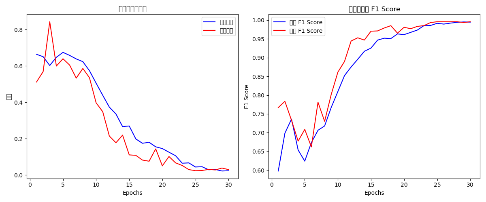

# 交通安全預警系統

一個智能交通安全監控系統，使用深度學習技術檢測潛在的交通危險並提供及時警報。

## 專案概述

本系統旨在分析實時交通視頻流，識別道路上可能存在的危險情況。通過結合卷積神經網絡（CNN）和長短期記憶網絡（LSTM），模型處理圖像序列以檢測可能表明安全風險的模式，如不安全的駕駛行為或危險的道路狀況。

當檢測到風險時，系統會提供視覺和聽覺警報（"慢下來"）以警告駕駛員或交通監控人員。

## 主要特點

- **基於深度學習的檢測**：利用ResNet+LSTM架構分析交通場景中的時間序列
- **實時分析**：實時處理視頻幀，提供即時危險檢測
- **語音警報**：當檢測到危險情況時提供語音警告
- **視覺指示器**：在監控界面上顯示狀態和風險概率
- **高準確性**：在測試中達到高達99%的危險情況檢測準確率

## 模型架構

該系統採用了結合以下技術的複雜神經網絡架構：

- **ResNet18特徵提取**：處理單個幀以提取空間特徵
- **雙向LSTM**：分析幀序列中的時間模式
- **注意力機制**：專注於序列中最相關的幀
- **分類層**：基於處理後的特徵進行最終風險評估



## 安裝說明

### 系統要求

- Python 3.6+
- PyTorch 2.5+
- CUDA支持的GPU（推薦）

### 必需的套件

```
torch==2.5.1
opencv-python==4.10.0.84
numpy==1.26.2
torchvision==0.20.1
pyttsx3==2.98
Pillow==10.1.0
```

您可以使用以下命令安裝所有依賴項：

```bash
pip install -r requirements.txt
```

## 使用方法

### 訓練

要使用您自己的數據訓練模型：

```bash
python 期末報告.ipynb
```

訓練過程包括數據預處理、模型訓練和評估。

### 演示應用

要運行安全警報演示：

```bash
python 0302NewDemo.py
```

這將會：
1. 載入預訓練模型
2. 處理示範交通序列
3. 視覺化檢測結果
4. 在檢測到風險時提供語音警告

## 模型性能

該模型達到：
- **準確率**：99.58%
- **精確度**：100.00%
- **召回率**：99.16%
- **F1分數**：99.58%

混淆矩陣：
```
[[239   0]
 [  2 237]]
```

## 專案結構

- `0302NewDemo.py` - 主演示應用程序
- `期末報告.ipynb` - 包含所有代碼和實驗的訓練筆記本
- `model/` - 包含訓練好的模型權重的目錄
- `train/train/` - 訓練數據目錄

## 模型實現細節

模型實現包括：

```python
class ResNetLSTM(nn.Module):
    def __init__(self, num_classes=1):
        super(ResNetLSTM, self).__init__()
        
        # 基於ResNet18的特徵提取器
        from torchvision.models import resnet18, ResNet18_Weights
        self.feature_extractor = resnet18(weights=None)
        self.feature_size = self.feature_extractor.fc.in_features
        self.feature_extractor.fc = nn.Identity()
        
        # 注意力機制
        self.attention = nn.Sequential(
            nn.Linear(512, 128),
            nn.Tanh(),
            nn.Linear(128, 1),
            nn.Softmax(dim=1)
        )
        
        # LSTM層
        self.lstm = nn.LSTM(
            input_size=512,
            hidden_size=256,
            num_layers=2,
            batch_first=True,
            dropout=0.5,
            bidirectional=True
        )
        
        # 分類層
        self.classifier = nn.Sequential(
            nn.Linear(512, 128),
            nn.LayerNorm(128),
            nn.Dropout(0.5),
            nn.ReLU(inplace=True),
            nn.Linear(128, 64),
            nn.LayerNorm(64),
            nn.Dropout(0.3),
            nn.ReLU(inplace=True),
            nn.Linear(64, num_classes)
        )
```

## 授權

本項目可用於教育和研究目的。

## 致謝

特別感謝所有貢獻者和開源社區提供的工具和框架，使這個項目成為可能。
