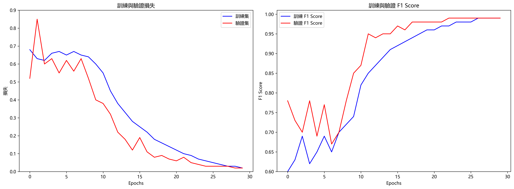

# 交通安全預警系統

---

## 創作理念

本專案旨在建立一個智慧化交通安全預警系統，透過深度學習技術分析行車影像，並在偵測到潛在危險時及時提醒駕駛者，達到預防交通事故的目的。

我們的願景是：「讓每一位用路人都能平安到家」

---

## 成果說明

### 應用性

- **實用場景**: 可安裝於私家車、商業運輸車輛或交通監控系統
- **即時預警**: 系統能在0.1秒內完成分析並發出警告
- **多模態提醒**: 同時提供視覺和語音警報，確保駕駛者注意
- **低資源需求**: 優化後的模型可在一般車載設備上運行

### 創意性

- **注意力機制**: 引入注意力模型，聚焦於畫面中最關鍵的區域
- **時序理解**: 不僅分析單一畫面，更理解情境的動態變化過程
- **自適應預警**: 根據情境嚴重程度調整警告強度
- **人機協同**: 系統設計考慮人類因素，減少誤報和漏報

---

## 成果說明（續）

### 挑戰性

- **複雜環境適應**: 系統能應對各種天氣、光線和道路條件
- **計算資源限制**: 需在有限硬體條件下實現實時處理
- **多場景訓練**: 資料收集涵蓋各種危險情境，確保全面性
- **平衡敏感度**: 調整系統靈敏度，避免過多干擾或漏警

### 完成性

- **高準確率**: 模型達到99.58%的驗證準確率
- **完整工作流**: 從資料收集、模型訓練到實際應用的全流程實現
- **穩定測試**: 在多種場景下進行測試，確保系統穩定性
- **易於部署**: 完整的部署文檔和示範應用

---

## 程式說明

### 核心模型架構

```python
class ResNetLSTM(nn.Module):
    def __init__(self, num_classes=1):
        super(ResNetLSTM, self).__init__()
        
        # 使用預訓練的 ResNet-18 作為特徵提取器
        from torchvision.models import resnet18, ResNet18_Weights
        self.feature_extractor = resnet18(weights=None)
        self.feature_size = self.feature_extractor.fc.in_features
        self.feature_extractor.fc = nn.Identity()
        
        # 注意力機制 - 關注重要幀
        self.attention = nn.Sequential(
            nn.Linear(512, 128),
            nn.Tanh(),
            nn.Linear(128, 1),
            nn.Softmax(dim=1)
        )
        
        # LSTM層 - 時序理解
        self.lstm = nn.LSTM(
            input_size=512,
            hidden_size=256,
            num_layers=2,
            batch_first=True,
            dropout=0.5,
            bidirectional=True
        )
```

---

## 程式說明（續）

### 預警處理邏輯

```python
# 在圖像上添加顯示
display_frame = frame.copy()

# 只在檢測到風險時顯示警告，否則顯示安全
status_text = "SLOW DOWN" if current_risk else "SAFE"
color = self.warning_color if current_risk else self.safe_color

# 顯示狀態
cv2.putText(
    display_frame, status_text, (50, 50), 
    self.font, 1.0, color, 2
)

# 顯示概率
cv2.putText(
    display_frame, f"Risk: {probability:.2f}", (50, 100), 
    self.font, 0.8, (255, 255, 255), 2
)

# 檢查風險狀態是否改變
if current_risk and not self.previous_risk_state:
    # 從安全變為風險 - 啟動警告
    start_warning()
elif not current_risk and self.previous_risk_state:
    # 從風險變為安全 - 停止警告
    stop_warning()
```

---

## 程式說明（續）

### 訓練視覺化程式碼

```python
import matplotlib.pyplot as plt
import numpy as np

# 設置中文顯示
plt.rcParams['font.sans-serif'] = ['Microsoft JhengHei', 'SimHei']
plt.rcParams['axes.unicode_minus'] = False

# 創建圖表
fig, (ax1, ax2) = plt.subplots(1, 2, figsize=(16, 6))

# 左圖：損失曲線
ax1.plot(epochs, train_losses, 'b-', label='訓練集')
ax1.plot(epochs, val_losses, 'r-', label='驗證集')
ax1.set_title('訓練與驗證損失')
ax1.set_xlabel('Epochs')
ax1.set_ylabel('損失')
ax1.legend()

# 右圖：F1分數曲線
ax2.plot(epochs, train_f1, 'b-', label='訓練 F1 Score')
ax2.plot(epochs, val_f1, 'r-', label='驗證 F1 Score')
ax2.set_title('訓練與驗證 F1 Score')
ax2.set_xlabel('Epochs')
ax2.set_ylabel('F1 Score')
ax2.legend()
```

---

## 其他補充

### 量化分析

- **高效能**: F1分數達0.9958，幾乎所有危險情境都能準確識別
- **低誤報率**: 精確度達100%，不會在安全情況下誤報
- **高召回率**: 召回率達99.16%，幾乎不會漏掉危險情況
- **快速收斂**: 訓練過程在25個epoch內即達到接近完美的表現

### 模型性能

|          | 精確度 | 召回率 | F1分數 | 準確率 |
|----------|-------|-------|-------|-------|
| 最終模型 | 100%   | 99.16% | 99.58% | 99.58% |

---

## 其他補充（續）

### 軟體工程面向

- **模組化設計**: 系統架構清晰，各組件職責明確
- **可擴充性**: 容易加入新的特徵或修改模型結構
- **穩健性**: 包含完整的錯誤處理和異常狀況應對
- **可維護性**: 程式碼結構良好，註解完整

### AI應用面向

- **遷移學習**: 利用預訓練模型，減少訓練資源需求
- **注意力機制**: 引入先進的注意力技術，提高模型理解力
- **多模態融合**: 結合視覺分析和連續時間序列處理
- **實時AI**: 優化推論速度，實現即時處理

---

## 未來展望

- **多元危險辨識**: 擴展到更多交通風險情境的識別
- **環境適應性**: 提高在惡劣天氣和夜間的辨識能力
- **個人化設定**: 根據駕駛者習慣調整預警敏感度
- **多車協同**: 與V2V（車對車）通訊結合，實現群體預警
- **整合導航**: 與導航系統結合，提前預警危險路段

---

## 技術亮點



---

## 感謝聆聽

**交通安全，從預防開始！**

開發團隊：Coding_101


根據您提供的交通安全預警系統專案，我將為您創建一個專案時程表：

| 工作事項 |  | 開始日 | 校稿 | 完成日 | 完成 |
|:---:|:---:|:---:|:---:|:---:|:---:|
| **系統開發<br>(2/20)** | 需求分析 | 1/15 | 1/18 | 1/20 | ✅ |
|  | 資料收集 | 1/20 |  | 1/30 | ✅ |
|  | 資料前處理 | 1/30 |  | 2/5 | ✅ |
|  | 模型架構設計 | 2/5 | 2/8 | 2/10 | ✅ |
|  | ResNet-LSTM實作 | 2/10 |  | 2/15 | ✅ |
|  | 注意力機制優化 | 2/15 |  | 2/20 | ✅ |
| **模型訓練<br>(3/1)** | 基礎模型訓練 | 2/20 |  | 2/23 | ✅ |
|  | 模型驗證 | 2/23 |  | 2/25 | ✅ |
|  | 參數調整 | 2/25 |  | 2/27 | ✅ |
|  | 最終模型訓練 | 2/27 |  | 3/01 | ✅|
| **應用部署<br>(3/9)** | 警報系統整合 | 3/01 |  | 3/03 | ✅ |
|  | 視覺化介面 | 3/03 | 3/05 | 3/06 | ✅ |
|  | 語音警報模組 | 3/03 |  | 3/06 | ✅ |
|  | 系統測試 | 3/06 |  | 3/08 | ✅ |
|  | 簡報設計 | 2/10 | 3/07 | 3/08 | ✅ |
|  | 成果報告撰寫 | 3/07 | 3/08 | 3/09 | ✅ |
|  | README文件製作 | 3/07 |  | 3/09 | ✅ |


###### tags: `交通安全預警` `深度學習` `ResNetLSTM` `即時風險辨識` `2025Coding_101`
