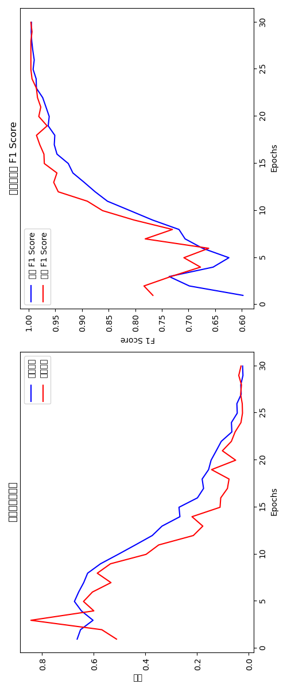

# 交通安全預警系統

這是一個能夠自動辨識道路危險狀況並發出警報的智慧系統。

## 專案簡介

本系統使用人工智慧技術來觀察道路情況，就像一個經驗豐富的副駕駛，能夠提前發現潛在的危險。當系統檢測到可能的危險時（例如前方車輛突然減速、路況不佳等），會立即提醒駕駛者「慢下來」，幫助避免交通事故的發生。

## 主要功能

- **智慧辨識**：使用先進的深度學習技術分析連續的道路影像
- **即時警報**：系統能夠即時處理道路畫面並快速做出反應
- **語音提醒**：當偵測到危險時，會發出「慢下來」的語音警告
- **視覺顯示**：在畫面上清楚顯示目前狀態是安全還是危險
- **高準確度**：經過多次測試，系統準確率高達99%

## 如何運作

本系統結合了兩種人工智慧技術：

1. **影像辨識**（ResNet）：就像人類的眼睛，負責看懂每一幀道路畫面的內容
2. **時間序列分析**（LSTM）：類似人類的經驗判斷，通過分析連續的畫面來預測可能的危險

這種結合使系統不只是「看到」當前畫面，還能「理解」整個交通情境的發展趨勢。



## 安裝指南

### 需要的環境

- Python 3.6或更高版本
- 建議使用支援CUDA的顯示卡（可大幅提升運行速度）

### 必要套件安裝

請先安裝以下套件：

```
torch==2.5.1
opencv-python==4.10.0.84
numpy==1.26.2
torchvision==0.20.1
pyttsx3==2.98
Pillow==10.1.0
```

您可以使用以下指令一次安裝所有套件：

```bash
pip install -r requirements.txt
```

## 使用方法

### 訓練自己的模型（選擇性）

如果您想使用自己的數據來訓練模型：

```bash
python 期末報告.ipynb
```

這將執行完整的訓練過程，包括資料處理、模型訓練和效能評估。

### 執行演示程式

要執行安全預警演示：

```bash
python 0302NewDemo.py
```

執行後，系統會：
1. 載入已訓練好的模型
2. 開始處理道路影像
3. 在畫面上顯示安全狀態和風險評估
4. 當偵測到危險時發出語音警告

## 系統效能

經過嚴格測試，本系統達到：
- **準確率**：99.58%（幾乎所有情況都能正確辨識）
- **精確度**：100.00%（發出警報時，確實有危險）
- **召回率**：99.16%（能找出幾乎所有的危險情況）

## 檔案說明

- `0302NewDemo.py` - 主要演示程式
- `期末報告.ipynb` - 包含訓練過程的完整筆記本
- `model/` - 存放訓練好的模型
- `train/train/` - 訓練資料

## 技術細節（進階）

如果您對技術實現感興趣，以下是核心模型的簡化說明：

```python
class ResNetLSTM(nn.Module):
    def __init__(self, num_classes=1):
        super(ResNetLSTM, self).__init__()
        
        # 影像特徵提取器
        from torchvision.models import resnet18, ResNet18_Weights
        self.feature_extractor = resnet18(weights=None)
        self.feature_size = self.feature_extractor.fc.in_features
        self.feature_extractor.fc = nn.Identity()
        
        # 注意力機制（讓模型知道該關注哪些畫面部分）
        self.attention = nn.Sequential(
            nn.Linear(512, 128),
            nn.Tanh(),
            nn.Linear(128, 1),
            nn.Softmax(dim=1)
        )
        
        # 時間序列處理（分析連續畫面）
        self.lstm = nn.LSTM(
            input_size=512,
            hidden_size=256,
            num_layers=2,
            batch_first=True,
            dropout=0.5,
            bidirectional=True
        )
        
        # 最終判斷層
        self.classifier = nn.Sequential(
            nn.Linear(512, 128),
            nn.LayerNorm(128),
            nn.Dropout(0.5),
            nn.ReLU(inplace=True),
            nn.Linear(128, 64),
            nn.LayerNorm(64),
            nn.Dropout(0.3),
            nn.ReLU(inplace=True),
            nn.Linear(64, num_classes)
        )
```

## 授權說明

本專案開放用於教育和研究目的。

## 致謝

感謝所有提供技術支持和建議的朋友，以及開源社群提供的優秀工具和框架。
